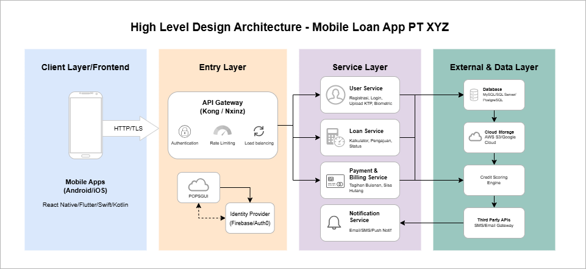
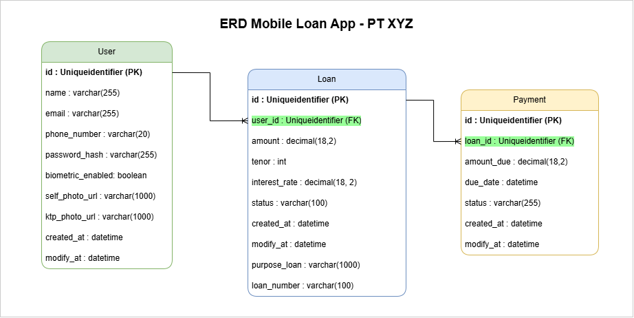
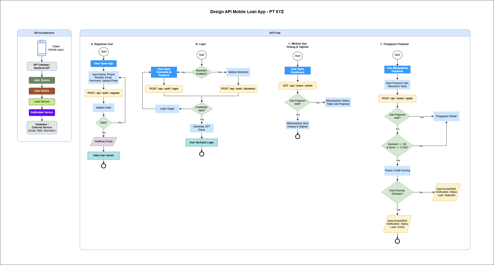

# Technical Assessment: Solution Analyst
**Candidate:** Trisnawati
**Role:** Solution Analyst
**Project:** Mobile Loan Application Design for PT. XYZ

---

## 1. High-Level Architecture
Sistem ini dirancang menggunakan **Microservices Architecture** untuk memastikan skalabilitas tinggi dan keamanan data keuangan pengguna.



### Core Components:
* **Mobile Client:** Dikembangkan menggunakan React Native/Flutter/Swift/Kotlin untuk cross-platform compatibility.
* **API Gateway:** Bertindak sebagai single entry point untuk otentikasi (JWT), Load Balancing dan rate limiting.
* **User Service:** Mengelola data profil, dokumen KTP, dan autentikasi biometrik.
* **Loan Engine Service:** Mengelola logika bisnis peminjaman, tenor, dan kalkulasi bunga.
* **Notification Service:** Mengintegrasikan pihak ketiga untuk pengiriman notifikasi via Email & SMS.

---

## 2. Database Design (ERD)
Desain basis data dirancang untuk menjaga integritas data dan riwayat pinjaman pengguna.



### Key Entities:
| Table Name   | Description |
|       :---   |        :--- |
| **User**     | Menyimpan data profil, email, telepon, dan path foto serta foto KTP. |
| **Loan**     | Menyimpan detail pinjaman (amount, tenor, status). |
| **Payment**  | Jadwal pembayaran bulanan dan status pelunasan. |

---

## 3. Business Process & Flowchart
Proses pengajuan pinjaman dilengkapi dengan validasi ketat untuk mencegah *double-loan* aktif.



### Loan Application Flow:
```mermaid
graph TD
    A[Start: Pengajuan Pinjaman] --> B{Cek Pinjaman Aktif?}
    B -- Ada --o C[Reject: Selesaikan pinjaman sebelumnya]
    B -- Tidak Ada --> D{Nominal <= 12jt & Tenor <= 1th?}
    D -- Tidak --> E[Reject: Melebihi Limit]
    D -- Ya --> F[Process: Credit Scoring System]
    F --> G{Hasil Scoring}
    G -- Diterima --> H[Status: Approved & Kirim Notifikasi]
    G -- Ditolak --> I[Status: Rejected & Kirim Notifikasi]
